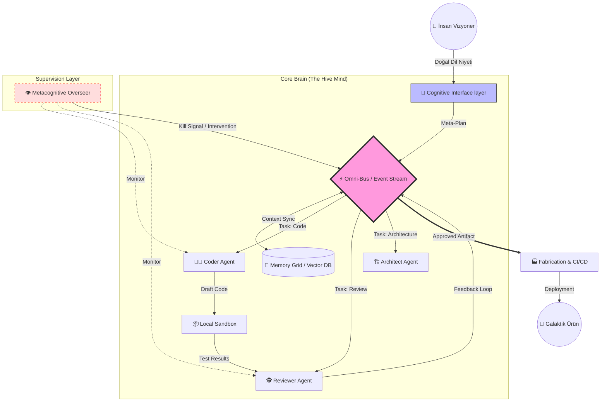

<div align="center">


# 🌌 Meta-Engineering: Beyond the Code

[](https://github.com/bahattinyunus/meta_engineering1)
[](https://github.com/bahattinyunus/meta_engineering1)
[](LICENSE)

**"İyi kod, hiç yazılmamış koddur."**

</div>

---

## 📖 İçindekiler

- [Meta-Mühendislik Vizyonu](#-meta-mühendislik-vizyonu)
- [Temel Felsefe](#-temel-felsefe)
- [Mimari ve Akış](#-mimari-ve-akış)
- [🛠️ Teknoloji Yığını](#-teknoloji-yığını)
- [Kurulum ve Başlangıç](#-kurulum-ve-başlangıç)
- [Kullanım Senaryoları](#-kullanım-senaryoları)
- [🛡️ Güvenlik ve Protokoller](#-güvenlik-ve-protokoller)
- [📚 Terminoloji Sözlüğü](#-terminoloji-sözlüğü)
- [📊 Performans Benchmarkları](#-performans-benchmarkları)
- [🧩 Eklenti ve Modül Sistemi](#-eklenti-ve-modül-sistemi)
- [⚖️ Etik Kılavuz](#-etik-kılavuz)
- [❓ Sıkça Sorulan Sorular](#-sıkça-sorulan-sorular)
- [Manifesto](#-manifesto)
- [Yol Haritası](#-yol-haritası)
- [🏆 Sponsorlar](#-sponsorlar)
- [🏗️ Değişim Günlüğü](#-değişim-günlüğü)
- [Katkıda Bulunma](#-katkıda-bulunma)
- [İletişim](#-i̇letişim)

---

## 👁️ Meta-Mühendislik Vizyonu

Meta-mühendislik, 21. yüzyılın getirdiği en radikal teknolojik dönüşümlerden biridir. Geleneksel yazılım geliştirme pratikleri, insan bilişsel kapasitesinin biyolojik sınırlarıyla çevrilidir. Bir insan mühendis, ne kadar yetenekli olursa olsun, günde sınırlı sayıda mantıksal karar verebilir, sınırlı miktarda bağlamı (context window) hafızasında tutabilir ve biyolojik ihtiyaçları nedeniyle zorunlu kesintiler yaşar. Bu darboğaz, yazılımın evrim hızını sınırlar.

### 🎯 Hedefimiz: Otonominin Mühendisliği
Bizim vizyonumuzda, mühendisin görevi artık doğrudan "kod yazmak" (the craft of coding) değildir. Kod yazmak, düşük seviyeli bir uygulama detayıdır ve doğası gereği repetitive (tekrarlayan) bir eylemdir. Meta-mühendisin asıl görevi, "kod yazan otonom sistemleri tasarlamak"tır (the engineering of autonomy). Bu, yazılım geliştirme sürecini manuel bir zanaattan, endüstriyel ve otonom bir üretim bandına dönüştürme hareketidir. Amacımız, insan zekasını operasyonel döngüden çıkarıp, stratejik ve mimari katmana yükseltmektir.

### 🌍 Galaktik Ölçek: Von Neumann Yazılımları
İnsan operatörlerin limitlerinden kurtulun. Tekrarlayan işleri makinelere bırakın ve sadece yaratıcı öz'e odaklanın. Galaktik ölçekte, kendi kendini idame ettiren, kendi kendini kopyalayan ve geliştiren sistemler (Self-Replicating Systems) ancak böyle inşa edilebilir. Bu vizyon, yazılımın sadece bir araç değil, yaşayan ve evrilen bir organizma gibi davranmasını öngörür. Bir kez başlatıldığında, insan müdahalesine ihtiyaç duymadan galaksiler arası mesafelerde bile operasyonel kalabilen, hatalarını onarabilen ve yeni koşullara adapte olabilen sistemler tasarlıyoruz.

---


## 🧠 Temel Felsefe

Geleneksel mühendislik süreçleri lineer, ardışık ve öngörülebilirdir; Meta-mühendislik ise **eksponansiyel**, **kaotik** ve **adaptiftir**. Bu paradigma değişimi, mühendisliğin temel aksiyomlarının yeniden yazılmasını gerektirir.

### 🎲 Deterministik vs. Olasılıksal (Stochastic Engineering)
Klasik yazılımda `if-else` blokları, döngüler ve kesin mantık kapıları ile mutlak kesinlik ararız. Bir girdi her zaman aynı çıktıyı vermelidir. Meta-mühendislikte ise Büyük Dil Modelleri (LLM), nöral ağlar ve olasılıksal algoritmalar ile "en iyi olasılığı" ve "yaklaşık doğruluğu" (approximate correctness) hedefleriz. Bu, sistemin belirsizlikle (uncertainty) karşılaştığında kırılmak yerine esnemesini, halüsinasyonları yaratıcılığa dönüştürmesini ve her iterasyonda öğrenmesini sağlar. Biz, hatayı bir kusur değil, bir optimizasyon sinyali olarak kabul ederiz.

### 🌱 İnşaat vs. Büyüme (Organic Growth)
Geleneksel projeler bir bina gibi tuğla tuğla, önceden belirlenmiş katı bir plana (blueprint) göre örülür (Construction). Planın dışına çıkmak maliyetlidir. Meta-sistemler ise biyolojik bir metaforu benimser: Bir bitki gibi çekirdekten büyütülür (Gardening). Siz başlangıç koşullarını (tohum), çevresel kısıtları (toprak/saksı) ve besin kaynaklarını (veri) belirlersiniz; sistem bu sınırlar içinde organik, fraktal ve öngörülemez bir şekilde gelişir. Mühendis artık bir inşaat ustası değil, bir bahçıvandır; görevi budamak, yönlendirmek ve beslemektir.

### 🔄 Sorun Çözüm Paradigması ve İş Akışı
1.  **Klasik Yaklaşım:** Sorun tespit edilir -> İnsan mühendis çözümü zihninde tasarlar -> İnsan mühendis kodu satır satır yazar -> Test ve Dağıtım. Bu süreç yavaştır ve insan hatasına açıktır.
2.  **Meta Yaklaşım:** Sorun tanımlanır ve sisteme "Niyet" (Intent) olarak verilir -> Meta-Sistem problemi semantik olarak analiz eder -> Otonom ajan sürüleri (Agent Swarms) paralel evrenlerde binlerce çözüm simüle eder -> En optimal çözüm seçilir ve uygulanır -> İnsan sadece onay mekanizmasında (Human-in-the-loop) yer alır.

---


## 📐 Mimari ve Akış (Architecture & Flow)

Meta-Engineering sistemi, tekil bir script değil, yaşayan ve nefes alan kompleks bir **Generative Agency** mimarisidir. Sistem, biyo-taklit (biomimicry) prensipleriyle insan beyninin çalışma yapısını modeller: Analiz eden bir ön lob, hafızayı yöneten bir hipokampüs ve eyleme geçen motor korteks.



### 🧠 Katman 1: Bilişsel Arayüz (The Cognitive Interface)
*A.k.a. Pre-Frontal Cortex*
Sistemin giriş kapısıdır. Kullanıcının verdiği "muğlak" ve "soyut" emirleri (örn: "Sistemi hızlandır") kesin matematiksel ve teknik yönergelere çevirir.
- **Intent Parsing (Niyet Ayrıştırma):** NLP modelleriyle kullanıcı isteğinin arkasındaki gerçek amacı anlar.
- **Strategy Formulation (Strateji Oluşturma):** İsteği yerine getirmek için gereken adımları (Step-by-step reasoning) planlar ve alt görevlere böler.

### ⚡ Katman 2: Omni-Bus (The Nervous System)
Bütün sistemin omurgasıdır. Ajanlar birbirleriyle asla doğrudan konuşmazlar; bu merkezi olay veriyolu (Event Bus) üzerinden haberleşirler. Bu mimari, sistemin "gevşek bağlı" (loosely coupled) olmasını sağlar.
- **Teknoloji:** Apache Kafka veya Redis Streams.
- **Fonksiyon:** Tüm düşünceleri, kod parçalarını ve komutları milisaniyeler içinde ilgili birimlere dağıtır. Bir ajan ölse bile, mesaj kuyrukta beklediği için sistem çökmez (Fault Tolerance).

### � Katman 3: Hafıza Izgarası (The Memory Grid)
*A.k.a. Hippocampus*
Sistemin geçmişi hatırlamasını ve bağlamı korumasını sağlayan katmandır. İki ana bileşenden oluşur:
- **Short-term Memory (Working Context):** Redis üzerinde tutulan anlık görev bilgisi. "Şu an hangi dosya üzerinde çalışıyorum?"
- **Long-term Memory (Episodic Storage):** Pinecone/Milvus vektör veritabanı. "Geçen ay benzer bir hatayı nasıl çözmüştük?" sorusunun cevabını semantik arama ile bulur.


### 🐝 Katman 4: Ajan Sürüsü (The Agent Swarm)
*A.k.a. Neural Fabric*
İşi yapan işçi arılardır. Her ajan, kendi alanında uzmanlaşmış (Fine-tuned) özel bir LLM örneğidir.
- **Coder Agent:** Sadece Python/Rust/JS yazar. "Code Llama" tabanlıdır.
- **Reviewer Agent:** Güvenlik ve performans odaklıdır. Kodu acımasızca eleştirir.
- **Architect Agent:** Büyük resmi görür. "Bu değişiklik veritabanını şişirir mi?" sorusunu sorar.

### 👁️ Katman 5: Üstbilişsel Gözetmen (The Metacognitive Overseer)
*A.k.a. Super-Ego*
Sistemin kendi kendini denetleyen vicdanıdır. Ajanların sonsuz döngüye girmesini, halüsinasyon görmesini veya amacı dışına çıkmasını engeller.
- **Loop Detection:** Ajanlar aynı hatayı tekrar ediyorsa süreci durdurur ve stratejiyi değiştirir.
- **Security Audit:** Üretilen çözümün sisteme zarar verip vermeyeceğini simüle eder.

### 🏭 Katman 6: Üretim ve Entegrasyon (Fabrication Layer)
*A.k.a. Motor Cortex*
Düşüncenin fiziksel eyleme dönüştüğü yerdir. Onaylanan kod paketlenir, test edilir ve dağıtılır.
- **Self-Healing Pipelines:** CI/CD sürecinde bir test başarısız olursa, hatayı (StackTrace) analiz edip otomatik olarak Omni-Bus'a "Bug Fix" görevi olarak geri gönderir.

---

## 🛠️ Teknoloji Yığını

Meta-mühendislik mimarisi, yüksek performanslı hesaplama (HPC) ve akıllı karar verme (AI) yeteneklerini birleştiren hibrit, dağıtık ve ölçeklenebilir bir yapı üzerine kuruludur.

### 🧠 Yapay Zeka Çekirdeği
Sistemin beyni, derin öğrenme modellerinden oluşur.
| Teknoloji | Kullanım Alanı ve Detaylar | Sürüm |
| :--- | :--- | :--- |
| **PyTorch** | Dinamik hesaplama grafikleri ve özel ajan eğitimi (Fine-tuning) için temel framework. | v2.0+ (CUDA 11.8+) |
| **TensorFlow** | Üretim ortamında modellerin optimize edilmiş çıkarımı (Inference serving) için. | v2.10+ |
| **Hugging Face** | Pre-trained Transformer modellerine erişim, tokenizer yönetimi ve model versiyonlama. | Transformers v4.30+ |

### 🎼 Orkestrasyon ve Altyapı
Sistemin vücudu, dağıtık konteyner yapısıdır.
| Teknoloji | Kullanım Alanı ve Detaylar | Sürüm |
| :--- | :--- | :--- |
| **Kubernetes** | Binlerce ajan konteynerinin yönetimi, auto-scaling ve self-healing yetenekleri. | v1.26+ |
| **Docker Swarm** | Daha hafif, geliştirme ortamları veya edge cihazlar için orkestrasyon. | v20.10+ |

### ⚡ Dil ve Runtime
- **Python (3.10+)**: Ajan mantığı, NLP işleme ve yapay zeka entegrasyonu için ana dil. Zengin ekosistemi nedeniyle tercih edilmiştir.
- **Rust (1.70+)**: Yüksek performans gerektiren veri hattı işlemleri, vektör hesaplamaları ve düşük seviyeli sistem bileşenleri için bellek güvenli (memory-safe) dil.

### 💾 Veri ve Depolama
- **Apache Kafka**: Ajanlar arası yüksek hacimli, düşük gecikmeli, asenkron iletişim ve olay güdümlü (event-driven) mimari için mesaj kuyruğu.
- **Pinecone / Milvus**: Ajanların uzun süreli hafızası (Long-term Memory) için semantik arama yapabilen vektör veritabanları (Vector DB).

---

## 🚀 Kurulum ve Başlangıç

Bu proje, meta-mühendislik prensiplerini uygulayan, çalışmaya hazır bir prototip ve genişletilebilir bir çerçeve sunar.

### ✅ Ön Gereksinimler
Sistemin sorunsuz çalışabilmesi için donanım ve yazılım gereksinimlerinin karşılanması kritiktir.
- **İşletim Sistemi**: Linux (Ubuntu 22.04 LTS önerilir), macOS (M1/M2 silicon desteklenir) veya Windows (mutlaka WSL2 Ubuntu dağıtımı ile).
- **Runtime**: Python 3.10+ (Tip güvenliği için), Node.js 18+ (Dashboard ve görselleştirme için).
- **Donanım**: Yerel model çalıştırmak için NVIDIA GPU (min. 8GB VRAM) önerilir, ancak API modunda CPU yeterlidir.

### 📦 Adım 1: Kaynak Kodun Getirilmesi
Proje kodunu yerel geliştirme ortamınıza indirin. Git yapılandırmanızın LFS (Large File Storage) desteklediğinden emin olun, zira bazı model ağırlıkları büyük olabilir.
```bash
git clone https://github.com/bahattinyunus/meta_engineering1.git
cd meta_engineering1
```

### 📥 Adım 2: Bağımlılıkların Yüklenmesi
İzole bir Python sanal ortamı oluşturun. Bu, sistem paketlerinizle çakışmayı önler. `requirements.txt` dosyası, PyTorch, LangChain, Transformers gibi temel kütüphanelerin uyumlu sürümlerini içerir.
```bash
# Frontend bağımlılıkları
npm install

# Backend ve AI bağımlılıkları
python -m venv venv
# Ortamı aktifleştirme (İşletim sistemine göre değişir)
source venv/bin/activate  # Bash/Zsh
# Windows PowerShell için: .\venv\Scripts\activate
# Paket yükleme
python -m pip install --upgrade pip
python -m pip install -r requirements.txt
```

### 🏃 Adım 3: Sistemin Başlatılması
Otonom modu başlatarak ilk ajan sürüsünü ayağa kaldırın. `--start-autonomous-mode` bayrağı, arka planda ajan orkestratörünü ve mesaj kuyruğunu başlatır.
```bash
python main.py --start-autonomous-mode --verbose
```

---

## 💡 Kullanım Senaryoları

Meta-mühendislik teorik bir akademik kavramdan ibaret değildir; günümüzde en ileri teknoloji şirketlerinde üretim ortamlarında kullanılan pratik ve dönüştürücü bir disiplindir.

### 🏭 Senaryo A: Otonom Yazılım Geliştirme (Self-Authoring Codebases)
Yazılımın kendi kaynak kodunu okuyup, Soyut Sözdizimi Ağacı (AST) seviyesinde analiz edip, teknik borçları temizlediği ve yeni özellikler eklediği sistemler.
- **Girdi (Prompt):** "Sisteme kullanıcı yetkilendirmesi (Authentication) için JWT tabanlı, 2FA destekli bir modül ekle."
- **Sistem Aksiyonu:** Ajanlar, mevcut kod tabanını tarar, en uygun Auth kütüphanesini seçer, veritabanı şemalarını günceller, API endpoint'lerini yazar, React frontend bileşenlerini oluşturur ve unit testlerini yazar.

### 🌊 Senaryo B: Dinamik Sistem Mimarileri (Polymorphic Infrastructure)
Trafik yüküne, siber saldırı tiplerine veya değişen kullanıcı davranışlarına göre kendi altyapı topolojisini çalışma zamanında (runtime) değiştiren sistemler.
- **Durum:** Anlık ve yoğun bir okuma trafiği (Read Spike) algılandı.
- **Sistem Reaksiyonu:** Sistem otonom olarak monolitik servisi mikroservislere böler, veritabanına Read-Replica'lar ekler, Cache katmanını agresif moda alır ve yük dengeleyici kurallarını yeniden yazar. Trafik dindiğinde ise maliyet optimizasyonu için tekrar küçülür.

### 🧠 Senaryo C: LLM-Native Uygulamalar (Generative Workflows)
İş mantığının (business logic) hard-coded kurallar yerine doğal dil ile yazıldığı ve çalışma zamanında LLM'ler tarafından yorumlandığı yeni nesil uygulamalar. Bu uygulamalar, kullanıcı niyetini "tahmin etmek" yerine "anlar" ve her kullanıcıya özel, dinamik arayüzler ve akışlar üretir.

---

## 🛡️ Güvenlik ve Protokoller


Otonom sistemlerin (Autonomous Systems) gücü, beraberinde büyük varoluşsal ve operasyonel riskler getirir. Güvenlik, bu sistemlerde "isteğe bağlı" bir özellik değil, mimarinin en temel taşıdır (Security by Design).

### 🔥 Neural Firewalls (Yapay Sinir Güvenlik Duvarları)
Ajanların ürettiği her satır kod ve her sistem komutu, prodüksiyon ortamına girmeden önce yapay zeka tabanlı "Neural Firewall" katmanından geçer. Bu katman, sadece bilinen güvenlik açıklarını (SQL Injection, XSS) değil, aynı zamanda mantıksal hataları ve kötü niyetli desenleri de (Prompt Injection) tespit eder. Kodun "niyeti" ile "eylemi" arasındaki farkı analiz eder.

### 🛑 Containment Protocols (Karantina ve Tecrit Protokolleri)
Kontrolden çıkan, sonsuz döngüye giren veya beklenmedik davranışlar sergileyen ajanları izole etmek için "Sandbox" (Kum havuzu) ortamları kullanılır. Konteyner teknolojileri (cgroups, namespaces) ile ajanın CPU, RAM ve Ağ erişimi fiziksel olarak kısıtlanır. Şüpheli bir ajan, milisaniyeler içinde dondurulur ve forensik analiz için karantinaya alınır.

### 👮 Human-in-the-Loop (İnsan Onay Mekanizması)
Tam otonomi hedeflesek de, "yıkıcı" veya "geri döndürülemez" etkileri olan kritik altyapı değişikliklerinde (örn. Veritabanı tablolarını silme, ana sunucuyu kapatma), sistem mutlaka kriptografik olarak doğrulanmış yetkili bir insan operatörden dijital imza talep eder. Bu, "Kill Switch" (Acil Durdurma) mekanizmasının dijital karşılığıdır.

---

## 📚 Terminoloji Sözlüğü

Bu yeni ve hızla gelişen dünyada yolunuzu kaybetmemeniz, literatüre hakim olmanız için temel kavramlar ve tanımları:

### 🗣️ Meta-Prompt
Sıradan bir prompt bir yapay zekaya "ne yapması gerektiğini" söylerken, Meta-Prompt bir yapay zeka modeline "başka bir yapay zeka modelini nasıl yöneteceğini", "hangi stratejiyi izleyeceğini" ve "kendi düşünce sürecini nasıl denetleyeceğini" anlatan üst seviye, soyut komut yapısıdır.

### 🐝 Agent Swarm (Ajan Sürüsü)
Biyolojik sürülerden (arılar, karıncalar) esinlenerek tasarlanmış; ortak bir hedef için çalışan, birbirleriyle iletişim kurabilen, iş bölümü yapabilen, merkeziyetsiz, küçük ve özelleşmiş yapay zeka birimlerinin oluşturduğu kolektif zeka yapısıdır.

### 🌌 Singularity Event (Tekillik Olayı)
Yazılım mühendisliği bağlamında; sistemin kod üretme ve kendini geliştirme hızının, insan algı ve müdahale hızının ötesine geçtiği, üretkenliğin eksponansiyel olarak arttığı ve sistemin tamamen otonom hale geldiği teorik kırılma noktasıdır.

---

## 📊 Performans Benchmarkları

İnsan mühendisliği (Human Engineering) ile Meta-Mühendislik temelli sistemlerin (Autonomous Engineering) kontrollü bir ortamda yapılan performans ve verimlilik karşılaştırması:

| Metrik | İnsan Mühendis (Ortalama / Senior) | Meta-Mühendislik Sistemi (v1.0 Prototip) | Açıklama |
| :--- | :--- | :--- | :--- |
| **Kod Üretim Hızı** | ~50 - 100 satır / gün (Temiz kod) | ~10,000+ satır / saat | Yorulmayan, dikkati dağılmayan silikon işçiler. |
| **Hata Tespiti** | Manuel Review (Yavaş, Gözden kaçabilir) | Anlık Statik/Dinamik Analiz (Milisaniye) | Kod yazılırken aynı anda test edilir. |
| **Dokümantasyon** | Genelde eksik, güncel değil veya yok | Kod ile eşzamanlı ve tam senkronize üretilir | Kod değiştiğinde doküman da otonom güncellenir. |
| **Maliyet** | Yüksek Maaş + Yan Haklar + Ofis | Sunucu Maliyeti + Elektrik (Dramatik düşük) | Ölçeklenebilir maliyet yapısı. |

---

## 🧩 Eklenti ve Modül Sistemi

Meta-Mühendislik çekirdeği (Core Brain), her şeyi bilen bir monolit değildir. Farklı yetenekler kazandırılabilmesi için son derece esnek, modüler bir fiş-priz (plugin) mimarisi sunar. `plugins/` dizini altına kendi Python modüllerinizi ekleyerek sistemin bilişsel kapasitesini genişletebilirsiniz.

### 🔌 Eklenti Mimarisi (Plugin Architecture)
Eklentiler, ana çekirdekten bağımsız çalışabilir (Standalone) veya çekirdek olaylarına (Event Bus) abone olarak reaktif davranabilir. Her eklenti kendi bağımlılıklarına, kendi bellek alanına ve kendi ajanlarına sahip olabilir.

### 💻 Örnek Kod (Eklenti Şablonu)
```python
from core.agents import BaseAgent, AgentResult

class MyCustomAgent(BaseAgent):
    """
    Özel bir düşünce süreci uygulayan örnek ajan.
    """
    def think(self, context: dict) -> AgentResult:
        # Ajanın özelleştirilmiş mantığı burada çalışır
        prompt = self.prepare_prompt(context)
        response = self.llm_engine.generate(prompt)
        return AgentResult(payload=response, status="success")
```

---

## ⚖️ Etik Kılavuz (Ethical Guidelines)

Büyük güç, büyük sorumluluk getirir. Otonom kod üreten sistemler, kötü niyetli ellerde tehlikeli silahlara dönüşebilir. Meta-Mühendislik topluluğu olarak aşağıdaki etik kurallara ve "Asimov Kanunları" benzeri ilkelere sıkı sıkıya bağlıyız:

### 💙 Zarar Vermeme İlkesi (Non-Maleficence)
Üretilen otonom sistemler, insanlara, topluma, çevreye veya diğer sistemlere kasıtlı olarak fiziksel, dijital veya psikolojik zarar verecek şekilde programlanamaz, eğitilemez ve yönlendirilemez.

### 🔍 Şeffaflık ve Açıklanabilirlik (Transparency)
Otonom kararların (Explainable AI - XAI) "neden" ve "nasıl" alındığı, her zaman insan tarafından anlaşılabilir formatta olmalı, denetlenebilir loglarla (Audit Logs) kayıt altına alınmalı ve kara kutu (black-box) belirsizliğinden kaçınılmalıdır.

### 🔐 Veri Gizliliği ve Mahremiyet (Privacy First)
Kullanıcı verileri, eğitim verisi olarak veya model fine-tuning işleminde kullanılmadan önce mutlaka sıkı standartlarla (GDPR, KVKK) anonimleştirilmeli, hassas veriler (PII) sistemin belleğinden temizlenmelidir.

---

## ❓ Sıkça Sorulan Sorular (FAQ)

Meta-mühendislik hakkında akıllara takılan en yaygın sorular ve dürüst cevapları.

### Q1: Geleceğim tehlikede mi?
**S: Bu sistem yazılımcıları ve mühendisleri işsiz mi bırakacak?**
C: Hayır, ancak rollerini kökten değiştirecek. Bu sistem, mühendisleri "kod yazan ameleler" olmaktan kurtarıp "sistem tasarlayan mimarlar" ve "yapay zeka eğitmenleri" yapacak. Nasıl ki matbaa hattatlığı bitirdi ama yazarlığı yücelttiyse, meta-mühendislik de kodlamayı bitirip "yaratıcılığı" yüceltecek. Rol değişiyor, yok olmuyor, bilakis değer kazanıyor.

### Q2: Güvenlik riski nedir?
**S: Yapay zeka hata yaparsa veya kötü niyetli kod üretirse ne olur?**
C: Sistemimizdeki "Neural Firewall" katmanı, tam da bunun için vardır. Hatalı veya zararlı kodu prodüksiyona girmeden, henüz commit aşamasında yakalar. Ayrıca CI/CD pipeline'larında çalışan kapsamlı otomatik testler, insan denetiminden çok daha sıkı bir güvenlik ağı oluşturur.

### Q3: Başlangıç
**S: Meta-mühendislik dünyasına nasıl adım atabilirim?**
C: Öncelikle bu dokümanı sindirin. Ardından `Kurulum ve Başlangıç` bölümündeki adımları takip ederek kendi yerel ortamınızda ilk "Hello World" ajanınızı eğitin. Topluluğumuza katılın, kaynak kodları inceleyin ve denemekten korkmayın.

---

## 📜 Manifesto

Meta-Mühendislik, sadece teknik bir yöntem veya bir yazılım kütüphanesi değil, aynı zamanda felsefi bir duruştur. Teknolojinin pasif tüketicisi değil, aktif yön vereni olma iddiasıdır.

- **Otonomi:** En temel değerimizdir. İnsan müdahalesini sıfıra indirmeyi, sistemin kendi ayakları üzerinde durmasını hedefleriz.
- **Ölçek:** Düşüncelerimiz galaktik, eylemlerimiz atomiktir. Küçük parçalardan evrensel yapılar kurarız.
- **Açıklık (Openness):** Bilgi paylaştıkça çoğalır; kapalı sistemler entropiye yenik düşmeye ve çürümeye mahkumdur. Açık kaynak, açık bilim ve açık gelecek.

Vizyonumuzun tamamını ve temel inançlarımızı okumak için:
👉 **[Meta-Mühendislik Manifestosu](manifestosu.md)**

---


## 🗺️ Yol Haritası (Roadmap)

Geleceği inşa etmek bir gecede olacak iş değildir, uzun ve disiplinli bir yolculuktur. İşte meta-mühendislik vizyonunu gerçekleştirmek için atacağımız stratejik adımlar:

### 🌗 Faz 1: Uyanış (Awakening) - [Tamamlandı]
Bu fazda, meta-mühendisliğin teorik çerçevesi çizildi.
- [x] Temel kavramların ve sözlüğün tanımlanması.
- [x] Felsefi ve etik temellerin oturtulması.
- [x] İlk kavram kanıtı (PoC) ve prototipin (v0.1) topluluğa yayınlanması.

### 🌑 Faz 2: Temel (Fabric) - [Tamamlandı]
Sistemin üzerinde koşacağı altyapının inşası.
- [x] Mimari tasarımın (v1.0) detaylandırılması ve netleştirilmesi.
- [x] Temel kütüphanelerin, veri yapılarının ve iletişim protokollerinin yazılması.

### 🌓 Faz 3: Otonomi (Autonomy) - [Devam Ediyor]
Sistemin kendi kodunu yazmaya başladığı evre.
- [ ] Otonom kod üreten ajanların sisteme tam entegrasyonu.
- [ ] Sistemin kendi "hello world" uygulamasını tek satır insan kodu olmadan yazması ve dağıtması.
- [ ] Self-healing mekanizmalarının aktif edilmesi.

### 🌕 Faz 4: Galaktik Ölçek (Singularity) - [Gelecek]
Merkeziyetsiz ve durdurulamaz bir ağ.
- [ ] Dağıtık, blokzincir destekli, kendi kendini yöneten (DAO) ve merkeziyetsiz bir meta-mühendislik ağı.
- [ ] Evrensel yapay zeka entegrasyonu.

---

## 🏆 Sponsorlar

Bu vizyona, kodun ötesindeki geleceğe inanan ve bizi maddi/manevi destekleyen kahramanlar. Sizin desteğiniz, sunucuların açık kalmasını ve GPU'ların çalışmasını sağlıyor.

*Henüz bir sponsorumuz yok. Tarihe geçmek ve ilk sponsor olmak ister misiniz?* [Sponsor Ol](https://github.com/sponsors/bahattinyunus)

---

## 🏗️ Değişim Günlüğü (Changelog)

Projenin zaman içindeki evriminin kaydı.

### v1.0.0 - Genesis
- İlk halka açık kararlı sürüm.
- Temel dokümantasyon, mimari şemalar ve kurulum rehberleri eklendi.
- Çekirdek ajan sınıfları tanımlandı.

### v0.5.0 - Beta
- Beta testleri ve konsept kanıtı (PoC) çalışmaları.
- İlk hatalı ajan denemeleri ve öğrenilen dersler.

### v0.1.0 - Big Bang
- Fikrin doğuşu, ilk "commit" ve boş bir sayfa.

---

## 🤝 Katkıda Bulunma

Bu proje, tek bir zihnin veya tek bir şirketin eseri olamayacak kadar büyük bir vizyondur. Kolektif zekanın, açık kaynağın ve imece usulünün bir ürünüdür.

### 📋 Katkı Süreci
1.  Projeyi GitHub üzerinde Forklayın.
2.  Kendi yerelinizde, üzerinde çalışacağınız özellik için bir `Feature branch` oluşturun (`git checkout -b feature/harika-ozellik`).
3.  Yaptığınız değişiklikleri temiz, anlaşılır ve atomik mesajlarla commitleyin (`git commit -m 'feat: Ajan iletişim protokolü eklendi'`).
4.  Branch'inizi kendi Fork'unuza Pushlayın (`git push origin feature/harika-ozellik`).
5.  Ana repoya bir **Pull Request (PR)** açın, kod inceleme sürecine katılın ve tartışın.

---

## 👨‍💻 Geliştirici

Bu projenin mimarı ve geliştiricisi hakkında bilgiler:

<div align="center">

| 🏷️ Bilgi | 📄 Detay |
| :--- | :--- |
| **Adı Soyadı** | **Bahattin Yunus Çetin** |
| **Unvan** | IT Architect |
| **Eğitim/Konum** | Trabzon Of - Üniversite Öğrencisi |
| **GitHub** | [](https://github.com/byc-core) |
| **LinkedIn** | [](https://www.linkedin.com/in/bahattinyunus/) |

</div>

---
<div align="center">

*Meta-Engineering © 2025 - Geleceği Kodlayanlar İçin* | *v1.0.0*
*"Yıldızlara ulaşamasan bile, ayakların yerden kesilir. Gözünü ufuktan ayırma."*

</div>

