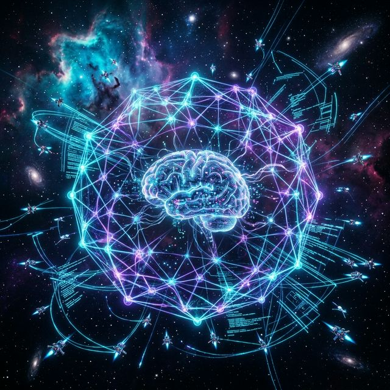
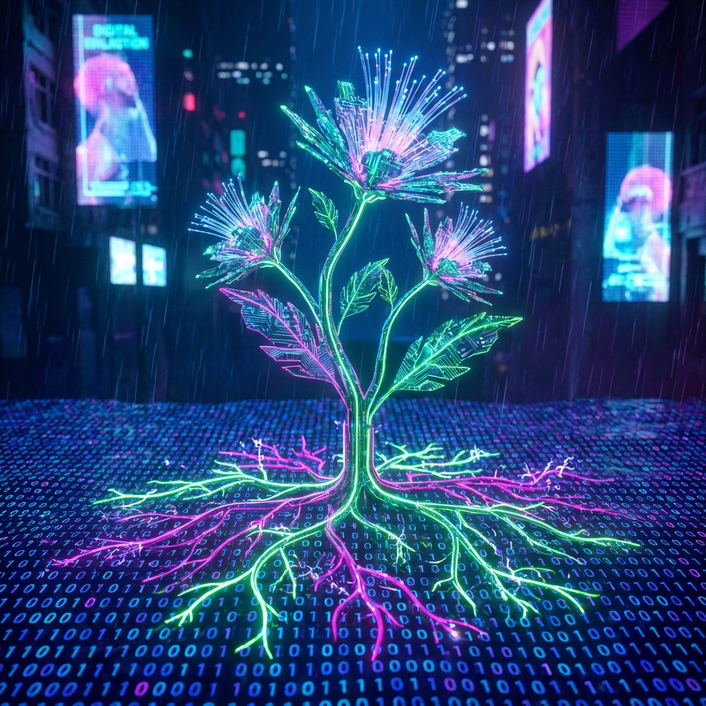
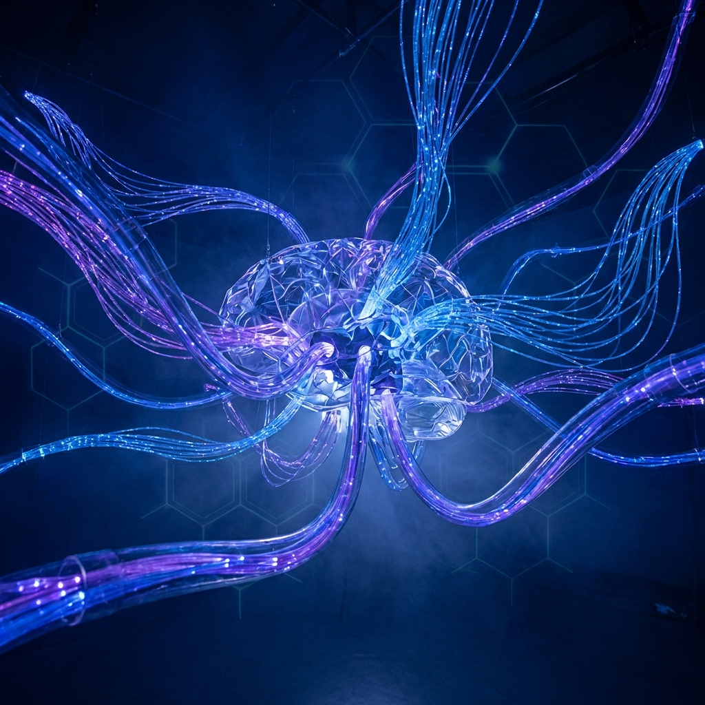
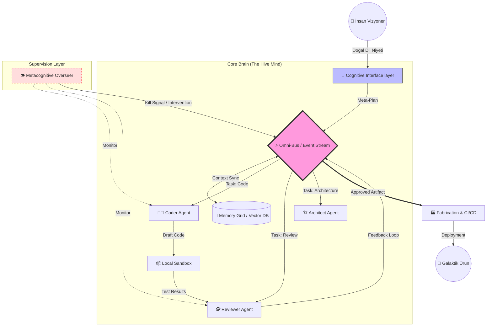
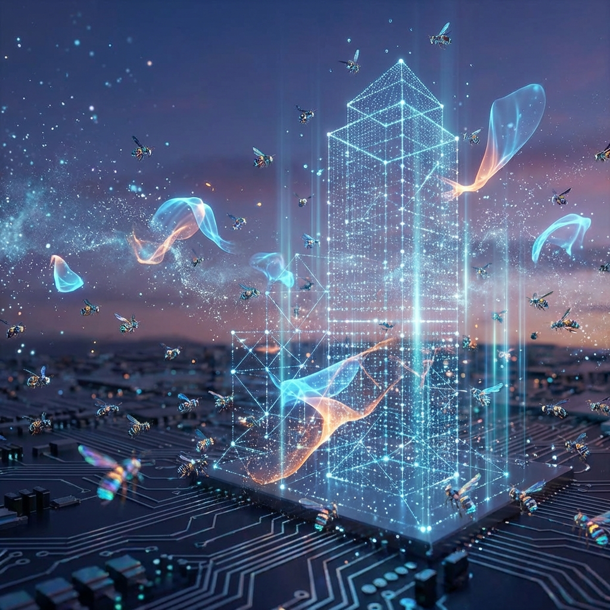
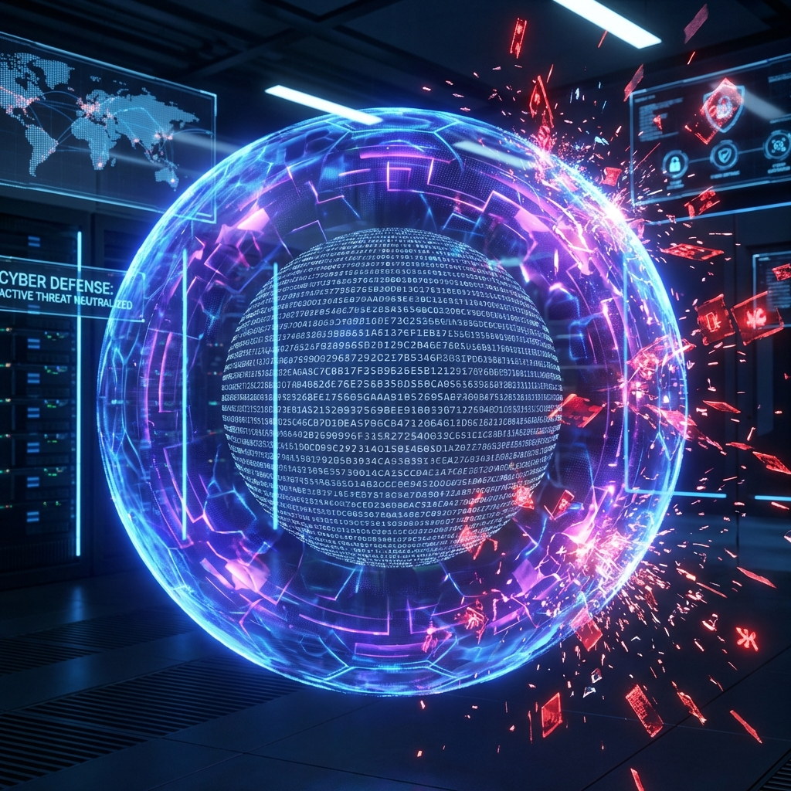

<div align="center">



# 🌌 Meta-Engineering: Beyond the Code

[](https://github.com/bahattinyunus/meta_engineering1)
[](https://github.com/bahattinyunus/meta_engineering1)
[](LICENSE)

**"İyi kod, hiç yazılmamış koddur. Mükemmel kod ise, insan eli değmemiş olandır."**

</div>

---

## 📖 İçindekiler

- [Meta-Mühendislik Vizyonu](#-meta-mühendislik-vizyonu)
- [Temel Felsefe](#-temel-felsefe)
- [Mimari ve Akış](#-mimari-ve-akış)
- [🛠️ Teknoloji Yığını](#-teknoloji-yığını)
- [Kurulum ve Başlangıç](#-kurulum-ve-başlangıç)
- [Kullanım Senaryoları](#-kullanım-senaryoları)
- [🛡️ Güvenlik ve Protokoller](#-güvenlik-ve-protokoller)
- [📚 Terminoloji Sözlüğü](#-terminoloji-sözlüğü)
- [📊 Performans Benchmarkları](#-performans-benchmarkları)
- [🧩 Eklenti ve Modül Sistemi](#-eklenti-ve-modül-sistemi)
- [⚖️ Etik Kılavuz](#-etik-kılavuz)
- [❓ Sıkça Sorulan Sorular](#-sıkça-sorulan-sorular)
- [Manifesto](#-manifesto)
- [Yol Haritası](#-yol-haritası)
- [🏆 Sponsorlar](#-sponsorlar)
- [🏗️ Değişim Günlüğü](#-değişim-günlüğü)
- [Katkıda Bulunma](#-katkıda-bulunma)
- [İletişim](#-i̇letişim)

---

## 👁️ Meta-Mühendislik Vizyonu

Meta-mühendislik, 21. yüzyılın bilgi işlem paradigmalarında yaşanan ve insanlık tarihinin en radikal teknolojik dönüşümlerinden biri olan, yazılımın kendi kendini var etme sürecidir. Geleneksel yazılım geliştirme pratikleri, ne kadar optimize edilirse edilsin, nihayetinde insan biyolojisinin getirdiği kaçınılmaz sınırlar ve bilişsel kapasitenin dar çerçevesi ile çevrilidir. Bir insan mühendis, alanında ne kadar yetkin, zeki veya deneyimli olursa olsun, biyolojik donanımı gereği günde sadece sınırlı sayıda yüksek kaliteli mantıksal karar verebilir, beyninin ön belleğinde (pre-frontal cortex) sınırlı miktarda bağlamı (context window) aktif olarak tutabilir ve uyku, beslenme, sosyal yaşam gibi biyolojik zorunluluklar nedeniyle üretim sürecinde kesintiler yaşamak zorundadır. Bu darboğaz, yazılımın teorik evrim hızını, insanın pratik üretim hızına hapseder.

### 🎯 Hedefimiz: Otonominin Mühendisliği (Engineering Autonomy)
Bizim sarsılmaz vizyonumuzda, geleceğin mühendisinin görevi artık doğrudan, satır satır "kod yazmak" (the craft of coding) gibi manuel ve düşük seviyeli bir uğraş değildir. Kod yazmak, büyük resme bakıldığında, sadece algoritmanın makine diline çevrilmesi sürecidir ve doğası gereği repetitive (tekrarlayan), hataya açık ve verimsiz bir eylemdir. Meta-mühendisin asıl, yüce ve stratejik görevi, "kod yazan otonom, zeki ve yaratıcı sistemleri tasarlamak"tır (the engineering of autonomy). Bu, yazılım geliştirme sürecini, zanaatkarın atölyesindeki manuel üretimden, binlerce robot kolun milimetrik hassasiyetle çalıştığı, durmaksızın üreten, endüstriyel ve otonom bir "kod fabrikasına" dönüştürme hareketidir. Nihai amacımız, kısıtlı insan zekasını operasyonel üretim döngüsünden tamamen çıkarıp, onu sadece stratejik, etik ve mimari katmanda karar verici (decision maker) konumuna yükseltmektir.

### 🌍 Galaktik Ölçek: Von Neumann Yazılımları
İnsan operatörlerin fiziksel ve zihinsel limitlerinden, yorgunluklarından ve önyargılarından tamamen kurtulun. Tekrarlayan, sıkıcı ve yıpratıcı işleri yorulmak bilmeyen silikon zekalara bırakın ve siz sadece evrensel yaratıcı öz'e odaklanın. Galaktik ölçekte işleyen, kendi kendine yetebilen, dışarıdan bir müdahaleye gerek duymadan kendi kendini kopyalayan, onaran ve geliştiren sistemler (Self-Replicating Systems / Von Neumann Probes) ancak bu zihniyetle inşa edilebilir. Bu vizyon, yazılımı sadece statik bir araç veya ölü bir dosya yığını olarak değil; yaşayan, nefes alan, Darwinist prensiplerle çevresine adapte olan ve sürekli evrilen dijital bir organizma olarak yeniden tanımlar. Bir kez başlatıldığında (Big Bang), insan müdahalesine ihtiyaç duymadan ışık yılı uzaklıktaki galaksiler arası mesafelerde bile operasyonel kalabilen, karşılaştığı bilinmeyen hataları kendi iç zekasıyla analiz edip onarabilen ve değişen kozmik koşullara adapte olabilen ölümsüz sistemler tasarlıyoruz.

---



## 🧠 Temel Felsefe

Geleneksel mühendislik disiplinleri, Newton fiziği gibi lineer, ardışık, deterministik ve büyük ölçüde öngörülebilirdir; Meta-mühendislik ise Kuantum fiziği gibi **eksponansiyel**, **kaotik**, **olasılıksal** ve **adaptiftir**. Bu köklü paradigma değişimi, mühendisliğin yüzyıllardır kabul gören temel aksiyomlarının ve "doğru bilinen yanlışların" baştan aşağı yeniden yazılmasını gerektirir.

### 🎲 Deterministik vs. Olasılıksal (Stochastic Engineering)
Klasik "Legacy" yazılım dünyasında, mühendisler `if-else` blokları, kesin döngüler ve rijit mantık kapıları ile mutlak bir kesinlik (determinism) arayışı içindedirler. Beklenti şudur: Bir girdi, evrenin sonuna kadar her zaman aynı çıktıyı vermelidir. Ancak Meta-mühendislikte biz, Büyük Dil Modelleri (LLM), derin nöral ağlar ve olasılıksal algoritmalar ile "en iyi olasılığı", "sezgisel çözümü" ve "yaklaşık doğruluğu" (approximate correctness) hedefleriz. Bu esneklik, sistemin belirsizlikle (uncertainty), eksik veriyle veya daha önce hiç görmediği bir durumla karşılaştığında klasik yazılımlar gibi kırılmak (crash) yerine, biyolojik bir beyin gibi esnemesini, elindeki verilerden çıkarım yapmasını ve "halüsinasyonları" yaratıcı, yenilikçi çözümlere dönüştürmesini sağlar. Biz, hatayı korkulacak bir kusur değil, sistemin öğrenmesi ve kendini kalibre etmesi için gerekli bir optimizasyon sinyali olarak kabul ederiz.

### 🌱 İnşaat vs. Büyüme (Organic Growth & Digital Gardening)
Geleneksel yazılım projeleri, tıpkı bir gökdelen inşaatı gibi yürütülür: Tuğla tuğla, kat kat, önceden milimetrik olarak belirlenmiş katı bir plana (blueprint/mimari çizim) sadık kalarak örülür (Construction). İnşaat başladıktan sonra planın dışına çıkmak, temelden değişiklik yapmak neredeyse imkansızdır ve maliyeti çok yüksektir. Oysa Meta-sistemler, biyolojik bir metaforu, "Bahçıvanlığı" benimser: Yazılım, bir bitki gibi çekirdekten (seed code) büyütülür (Gardening). Siz bir meta-mühendis olarak sadece başlangıç genetiğini (tohum/prompt), çevresel kısıtları (toprak/saksı/sandbox) ve besin kaynaklarını (veri/dokümantasyon) belirlersiniz; sistem bu sınırlar içinde organik, fraktal, kaotik ama muazzam bir düzen içinde kendi kendine büyür, dallanır ve gelişir. Mühendis artık elinde çekiç olan bir inşaat ustası değil, elinde makas olan bir bahçıvandır; görevi her tuğlayı koymak değil, uzayan dalları budamak (pruning), yönlendirmek ve sistemi beslemektir.

### 🔄 Sorun Çözüm Paradigması ve İş Akışı (The Workflow Shift)
Mühendislik sürecindeki rol dağılımı kökten değişiyor:
1.  **Klasik/Eski Yaklaşım:** Sorun tespit edilir -> İnsan mühendis günlerce düşünerek çözümü zihninde tasarlar -> İnsan mühendis çözümü klavye başında harf harf koda döker -> Test, Hata, Tekrar Yazım -> Dağıtım. Bu süreç, insan hızına endekslidir, yavaştır, yorucudur ve her aşaması insan hatasına açıktır.
2.  **Meta/Yeni Yaklaşım:** Sorun tanımlanır ve sisteme üst seviye bir "Niyet" (Intent) olarak verilir ("Bana güvenli bir ödeme sistemi kur") -> Meta-Sistem problemi semantik olarak analiz eder, parçalarına ayırır -> Otonom ajan sürüleri (Agent Swarms) paralel evrenlerde binlerce farklı çözüm yolunu aynı anda simüle eder -> En optimal, en güvenli ve en hızlı çözüm Darwinist bir seleksiyonla seçilir ve uygulanır -> İnsan sadece en sonda, bir yargıç gibi nihai onay mekanizmasında (Human-in-the-loop) yer alır.

---



## 📐 Mimari ve Akış (Architecture & Flow)

Meta-Engineering sistemi, basit, çalışan tekil bir script veya bir bot değil; yaşayan, nefes alan, düşünen ve sürekli iletişim halinde olan kompleks bir **Generative Agency** (Üretken Ajanlık) mimarisidir. Sistem, doğadan ilham alan biyo-taklit (biomimicry) prensipleriyle, insan beyninin çalışma yapısını silikon üzerinde modeller: Analitik kararlar veren bir ön lob, geçmiş deneyimleri ve bağlamı yöneten bir hipokampüs ve kararları fiziksel koda/eyleme dönüştüren bir motor korteks.



### 🧠 Katman 1: Bilişsel Çekirdek (The Cognitive Core / LLMEngine)
*A.k.a. Pre-Frontal Cortex (Ön Lob)*
Sistemin dış dünyaya açılan, kullanıcıyla temas eden bilinçli yüzü ve içsel düşünme motorudur. Kullanıcının genellikle doğal dilde verdiği "muğlak", "soyut" ve "duygusal" emirleri kesin matematiksel parametrelere çevirirken, ajanların da üretken yeteneklerini (Generative Reasoning) besler.
- **LLMEngine Mimarisi:** Sistem artık statik mock kurallar yerine, dinamik bir `LLMEngine` sınıfı ile güçlendirilmiştir. LangChain tabanlı bu arayüz, OpenAI, yerel Transformers (Llama-3 vb.) veya eğitim amaçlı Mock backend'leri arasında kusursuz geçiş sağlar.
- **Intent Parsing & Prompting:** Gelişmiş NLP modelleri kullanılarak, kullanıcının niyetleri ayrıştırılır ve "zincirleme akıl yürütme" (Chain-of-Thought) prensipleriyle karmaşık görevler atomik parçalara bölünür.

### ⚡ Katman 2: Omni-Bus (The Nervous System)
*A.k.a. Central Nervous System (Merkezi Sinir Sistemi)*
Bütün sistemin omurgası, haberleşme otobanı ve can damarıdır. Ajanlar, insan çalışanlar gibi birbirleriyle doğrudan, karışık toplantılarda konuşmazlar; bu son derece hızlı, düzenli ve merkezi olay veriyolu (Event Bus) üzerinden asenkron mesajlaşma ile haberleşirler. Bu mimari, sistemin "gevşek bağlı" (loosely coupled) olmasını sağlar, böylece bir modüldeki arıza diğerine sıçramaz.
- **Teknoloji:** Apache Kafka, RabbitMQ veya Redis Streams gibi endüstriyel standartlar.
- **Fonksiyon:** Milyonlarca düşünce, kod parçası, hata raporu ve komut paketini mikrosaniyeler içinde ilgili birimlere (Subscriber) dağıtır. Bir ajan çökse veya ölse bile, ona giden mesaj kaybolmaz, kuyrukta (Queue) bekler ve ajan yeniden doğduğunda kaldığı yerden devam eder (Fault Tolerance & High Availability).

###  Katman 3: Hafıza Izgarası (The Memory Grid)
*A.k.a. Hippocampus (Hipokampüs)*
Sistemin sadece o anı değil, geçmişi de hatırlamasını, bağlamı korumasını ve deneyimlerinden ders çıkarmasını sağlayan kritik katmandır. İki ana, biyolojik benzeri bileşenden oluşur:
- **Short-term Memory (Working Context):** Redis veya Memcached üzerinde tutulan uçucu, çok hızlı erişilen anlık görev bilgisi. "Şu an hangi dosya üzerinde çalışıyorum?", "Az önce hangi fonksiyonu yazdım?" gibi soruların cevabı buradadır.
- **Long-term Memory (Episodic Storage):** Pinecone, Milvus veya Weaviate gibi vektör veritabanları (Vector DB). Sistemin aylar, yıllar önceki deneyimlerini saklar. "Geçen yıl ödeme sisteminde çıkan benzer bir hatayı nasıl çözmüştük?" sorusunun cevabını, milyarlarca vektör arasından semantik benzerlik araması ile milisaniyeler içinde bulup getirir.



### 🐝 Katman 4: Üretken Ajan Sürüsü (Generative Agent Swarm)
*A.k.a. Neural Fabric (Nöral Doku)*
Sistemin elleri, ayakları ve işçileridir. Her bir ajan, kendi dikey uzmanlık alanında LLMEngine aracılığıyla gerçek zamanlı akıl yürütür (Generative Reasoning).
- **Architect Agent (DaVinci):** Kodun detayında boğulmaz, büyük resmi görür. Doğal dildeki vizyonu alır, alt sistem süreçlerine ve mimari akış şemalarına çevirir. Soyut düşünceyi somut görev listelerine döken ilk halkadır.
- **Coder Agent (Lovelace):** Sadece teorik değil, pratik üreticidir. Verilen görevi anlar ve `LLMEngine` kullanarak anında syntactically-valid (sözdizimsel olarak geçerli) Python kod paketleri üretir.
- **Reviewer Agent (Torvalds):** Yazılan her satırı didik didik eder. Sadece güvenlik açıklarını (CVE) aramakla kalmaz, aynı zamanda fiziksel sandbox'taki derleme test sonuçlarını okuyarak "Statik Doğrulama" felsefesiyle %100 kusursuzluğa ulaşmayı hedefler.

### 👁️ Katman 5: Üstbilişsel Gözetmen (The Metacognitive Overseer)
*A.k.a. Super-Ego (Üst Benlik)*
Sistemin kendi kendi üzerine düşünen, kendi düşünce süreçlerini denetleyen vicdanı ve yargıcıdır. Ajanların sonsuz bir tartışma döngüsüne girmesini, gerçeklikle bağını koparıp halüsinasyon görmesini veya amacı dışına çıkmasını (Mission Creep) engeller.
- **Loop Detection:** Ajanlar aynı hatayı 3 kereden fazla tekrar ediyorsa süreci durdurur ("Dur, düşün, yöntem değiştir") ve onlara farklı bir strateji (Lateral Thinking) önerir.
- **Security Audit:** Üretilen çözümün sisteme zarar verip vermeyeceğini sanal bir ortamda simüle eder, etik kurallara ve güvenlik politikalarına uygunluğunu denetler.

### 🏭 Katman 6: Fiziksel Üretim ve Sandbox (Fabrication Layer)
*A.k.a. Motor Cortex (Hareket Merkezi)*
Soyut düşüncenin somut fiziksel eyleme dönüştüğü yerdir. Ajanlar artık sadece simülasyon dünyasında "kod ürettim" demezler; gerçek dosya sistemi üzerinde manipülasyon yaparlar.
- **LocalSandbox Tesisleri:** Sistem, siber güvenlik politikaları gereği tüm üretimi `/workspace` adlı izole bir kum havuzunda gerçekleştirir. Bu alan, ana çekirdekten (kernel) ve konak işletim sisteminden (host) yalıtılmıştır.
- **Fiziksel Doğrulama (Static AST Checking):** `CoderAgent` tarafından `workspace/` dizinine yazılan her fiziksel dosya (.py), canlıya alınmadan hemen önce `ReviewerAgent` tarafından okunur ve Python `compile()` mekanizmasıyla statik AST testine tabi tutulur. Hatalı dosyalar otonom olarak reddedilir ve düzeltme için geri gönderilir.

---

## 🛠️ Teknoloji Yığını

Meta-mühendislik mimarisi, sıradan web teknolojileriyle değil, yüksek performanslı hesaplama (HPC), dağıtık sistemler ve en ileri akıllı karar verme (AI) yeteneklerini birleştiren hibrit, ölçeklenebilir ve son derece karmaşık bir yapı üzerine kuruludur.

### 🧠 Yapay Zeka Çekirdeği
Sistemin entelektüel gücünü oluşturan, beyni simüle eden derin öğrenme modelleri ve kütüphaneler.
| Teknoloji | Kullanım Alanı ve Detaylar | Sürüm Gereksinimi |
| :--- | :--- | :--- |
| **PyTorch** | Araştırma, dinamik hesaplama grafikleri ve ajanların özel veri setleriyle eğitimi (Fine-tuning) için kullanılan birincil framework. Esnekliği nedeniyle tercih edildi. | v2.0+ (CUDA 11.8+ Destekli) |
| **TensorFlow** | Üretim ortamında modellerin optimize edilmiş, düşük gecikmeli çıkarımı (Inference serving - TFX) ve model dağıtımı için. | v2.10+ |
| **Hugging Face** | Dünyanın en geniş açık kaynak model kütüphanesi. Pre-trained Transformer modellerine erişim, tokenizer yönetimi ve model versiyonlama (Model Hub) için standart. | Transformers v4.30+ |
| **LangChain** | LLM'leri zincirleme, hafıza yönetimi (Memory) ve ajanların araç (Tool) kullanımı için üst seviye orkestrasyon katmanı. | v0.0.200+ |

### 🎼 Orkestrasyon ve Altyapı
Sistemin fiziksel vücudu, kasları ve iskeleti. Dağıtık konteyner yapısı.
| Teknoloji | Kullanım Alanı ve Detaylar | Sürüm Gereksinimi |
| :--- | :--- | :--- |
| **Kubernetes** | Binlerce bağımsız ajan konteynerinin (Pod) yönetimi, yük durumuna göre otomatik ölçeklendirme (HPA) ve kendi kendini iyileştirme (Self-healing deployments). | v1.26+ |
| **Docker Swarm** | Daha hafif, geliştirme ortamları, yerel testler veya kaynak kısıtlı edge cihazlar için alternatif orkestrasyon motoru. | v20.10+ |
| **Helm** | Karmaşık mikroservis mimarisinin paketlenmesi, versiyonlanması ve tek komutla dağıtılması (Infrastructure as Code) için. | v3.0+ |

### ⚡ Dil ve Runtime
- **Python (3.10+)**: Ajan mantığı, NLP işleme, yapay zeka entegrasyonu ve prototipleme için ana dil (Lingua Franca). Zengin yapay zeka ekosistemi ve kütüphane desteği nedeniyle tartışmasız lider.
- **Rust (1.70+)**: Yüksek performans gerektiren veri hattı işlemleri, vektör hesaplamaları, oyun motoru entegrasyonları ve düşük seviyeli sistem bileşenleri için bellek güvenli (memory-safe) ve ışık hızında dil.

### 💾 Veri ve Depolama
- **Apache Kafka**: Ajanlar arası saniyede milyonlarca mesaj taşıyabilen, "Exactly-once" garantili iletişim ve olay güdümlü (event-driven) mimari için endüstri standardı streaming platformu.
- **Pinecone / Milvus**: Ajanların uzun süreli, anlamsal hafızası (Long-term Memory) için semantik arama yapabilen, milyar ölçeğinde vektör saklayabilen yeni nesil veritabanları (Vector DB).
- **PostgreSQL (TimescaleDB)**: Zaman serisi verileri, metrikler ve yapısal ilişkisel veriler için kaya gibi sağlam ana veritabanı.

---

## 🚀 Kurulum ve Başlangıç

Bu proje, sadece okunacak bir doküman değil; meta-mühendislik prensiplerini bizzat deneyimlemeniz için tasarlanmış, çalışmaya hazır, modüler ve genişletilebilir bir prototip çerçevedir.

### ✅ Ön Gereksinimler
Sistemin vaat ettiği performansı verebilmesi ve tam otonomide çalışabilmesi için aşağıdaki donanım ve yazılım gereksinimlerinin eksiksiz karşılanması kritiktir.
- **İşletim Sistemi**: Linux (Ubuntu 22.04 LTS veya üstü şiddetle önerilir), macOS (M1/M2/M3 silicon çipleri tam desteklenir) veya Windows (mutlaka WSL2 Ubuntu dağıtımı ile, native Windows desteği sınırlıdır).
- **Runtime**: Python 3.10+ (Modern tip güvenliği ve async özellikleri için), Node.js 18+ (Gerçek zamanlı Dashboard ve görselleştirme arayüzleri için).
- **Donanım**: Eğer yerel LLM modelleri (Llama-2, Mistral vb.) çalıştırılacaksa NVIDIA GPU (en az 8GB VRAM, tercihen 24GB+) şarttır. Sadece OpenAI/Claude API modunda çalışacaksanız modern bir çok çekirdekli CPU yeterlidir.

### 📦 Adım 1: Kaynak Kodun Getirilmesi
Proje kodunu ve tüm alt modülleri yerel geliştirme ortamınıza indirin. Git yapılandırmanızın LFS (Large File Storage) desteklediğinden emin olun, zira bazı model ağırlıkları ve veri setleri çok büyük olabilir.
```bash
# Git LFS'i yükleyin (Eğer yüklü değilse)
git lfs install

# Repoyu klonlayın
git clone https://github.com/bahattinyunus/meta_engineering1.git

# Proje dizinine girin
cd meta_engineering1
```

### 📥 Adım 2: Bağımlılıkların Yüklenmesi
İzole, temiz ve kararlı bir Python sanal ortamı oluşturun. Bu, sistem paketlerinizle çakışmayı önler ve taşınabilirliği artırır. `requirements.txt` dosyası, PyTorch, LangChain, Transformers gibi temel kütüphanelerin uyumlu ve test edilmiş sürümlerini içerir.
```bash
# Frontend (Dashboard) bağımlılıklarını kurun
npm install

# Backend ve AI bağımlılıkları için sanal ortam
python -m venv venv

# Ortamı aktifleştirme (Kabuğunuza göre seçin)
source venv/bin/activate  # Bash/Zsh kullanıcıları
# Windows PowerShell için: .\venv\Scripts\activate

# Paket yöneticisini güncelleyin ve kütüphaneleri yükleyin
python -m pip install --upgrade pip
python -m pip install -r requirements.txt
```

### 🏃 Adım 3: Sistemin Başlatılması
Otonom modu başlatarak ilk ajan sürüsünü "uyandırın". `--start-autonomous-mode` bayrağı, arka planda ajan orkestratörünü, mesaj kuyruğunu ve vektör veritabanı bağlantılarını başlatır. `--verbose` modu, ajanların "düşüncelerini" terminalde akarken görmenizi sağlar.
```bash
# Swarm'ı (Sürüyü) başlatın
python main.py --start-autonomous-mode --verbose
```
*Tebrikler! Artık bilgisayarınızda yaşayan, düşünen ve kod yazan bir silikon yaşam formu var.*

---

## 💡 Kullanım Senaryoları

Meta-mühendislik yalnızca teorik, akademik veya fütüristik bir kavramdan ibaret değildir; günümüzde en ileri teknoloji şirketlerinin (FAANG), yüksek frekanslı alım satım (HFT) firmalarının ve araştırma laboratuvarlarının kapalı kapılar ardında kullandığı, üretim ortamlarında (Production) aktif olarak çalışan pratik, yıkıcı ve dönüştürücü bir disiplindir.

### 🏭 Senaryo A: Otonom Yazılım Geliştirme (Self-Authoring Codebases)
Yazılımın kendi kaynak kodunu bir insan gibi okuyup, Soyut Sözdizimi Ağacı (AST) ve Kontrol Akış Grafiği (CFG) seviyesinde analiz edip, biriken teknik borçları (Technical Debt) temizlediği, eski kütüphaneleri güncellediği ve verilen isterlere göre yeni özellikler eklediği sistemler.
- **Girdi (Prompt):** "Sisteme kullanıcı yetkilendirmesi (Authentication) için JWT standardına uygun, 2FA destekli, Rate Limiting korumalı güvenli bir modül ekle."
- **Sistem Aksiyonu:** Ajanlar, mevcut kod tabanını tarar, en uygun Auth kütüphanesini seçer, veritabanı şemalarını (Migration) hazırlar, API endpoint'lerini (REST/GraphQL) yazar, React frontend bileşenlerini oluşturur, tüm birim (Unit) ve entegrasyon testlerini yazar, çalıştırır ve PR açar.

### 🌊 Senaryo B: Dinamik Sistem Mimarileri (Polymorphic Infrastructure)
Gelen, anlık trafik yüküne, tespit edilen siber saldırı tiplerine (DDoS, SQLi) veya değişen kullanıcı davranış kalıplarına göre, kendi altyapı topolojisini, sunucu sayısını ve ağ yapısını çalışma zamanında (runtime) dinamik olarak değiştiren, şekil değiştiren (polymorphic) sistemler.
- **Durum:** Anlık ve çok yoğun, şüpheli bir okuma trafiği (Read Spike) algılandı.
- **Sistem Reaksiyonu:** Sistem otonom olarak durumu analiz eder; monolitik servisi saniyeler içinde mikroservislere böler, veritabanına 10 adet Read-Replica ekler, Cache katmanını agresif moda alır, CDN kurallarını sıkılaştırır ve yük dengeleyici (Load Balancer) kurallarını yeniden yazar. Trafik dindiğinde ise maliyet optimizasyonu için tekrar küçülür ve boş kaynakları kapatır.

### 🧠 Senaryo C: LLM-Native Uygulamalar (Generative Workflows)
İş mantığının (business logic) insanlar tarafından yazılmış katı, `if-then` kuralları yerine; doğal dil ile ifade edildiği ve çalışma zamanında LLM'ler tarafından anlık olarak yorumlanıp yürütüldüğü yeni nesil "akışkan" uygulamalar. Bu uygulamalar, kullanıcı niyetini menüler arasında gezinerek "tahmin etmek" yerine, doğrudan "anlar" ve her kullanıcıya özel, o an üretilen dinamik arayüzler (Generative UI) ve akışlar sunar.

---

## 🛡️ Güvenlik ve Protokoller



Otonom sistemlerin (Autonomous Systems), ajansiyel yapay zekaların gücü, insanın hayal gücünü zorlayan seviyededir. Ancak bu güç, kontrolsüz bırakıldığında beraberinde büyük varoluşsal, etik ve operasyonel riskler getirir. Bu nedenle güvenlik, bu sistemlerde sonradan eklenen "isteğe bağlı" bir özellik değil, mimarinin en temel taşı, varoluş sebebi ve değiştirilemez doğasıdır (Security by Design & Default).

### 🔥 Neural Firewalls (Yapay Sinir Güvenlik Duvarları)
Ajanların ürettiği her bir satır kod, her bir SQL sorgusu ve her sistem komutu, canlı (prodüksiyon) ortama girmeden önce çok katmanlı, yapay zeka destekli "Neural Firewall" sisteminden geçer. Bu katman, sadece geleneksel WAF'lar gibi bilinen güvenlik açıklarını (SQL Injection, XSS, CSRF) değil, aynı zamanda çok daha karmaşık, bağlamsal mantık hatalarını, arka kapıları (backdoors) ve kötü niyetli desenleri (Prompt Injection) tespit eder. Kodun sadece ne yaptığına değil, "niyetine" (Intent Analysis) odaklanır. Şüpheli bir durumda kodu bloke eder ve karantinaya alır.

### 🛑 Containment Protocols (Karantina ve Tecrit Protokolleri)
Kontrolden çıkan, sonsuz döngüye giren, kaynakları sömüren veya beklenmedik, tanımlanmamış davranışlar (Emergent Misbehavior) sergileyen ajanları anında izole etmek için askeri düzeyde "Sandbox" (Kum havuzu) ortamları kullanılır. Konteyner teknolojileri (cgroups, namespaces, gVisor) ile ajanın CPU, RAM, Disk ve Ağ erişimi fiziksel seviyede kısıtlanır. Şüpheli davranış sergileyen bir ajan, milisaniyeler içinde dondurulur (Cryostasis), ağdan koparılır ve forensik analiz için dijital bir hücrede karantinaya alınır.

### 👮 Human-in-the-Loop (İnsan Onay Mekanizması & Kill Switch)
Tam otonomi nihai hedefimiz olsa da, "yıkıcı", "geri döndürülemez" veya "yüksek riskli" etkileri olan kritik altyapı değişikliklerinde (örneğin: Canlı veritabanı tablolarını silme, ana sunucuyu kapatma, ödeme altyapısını değiştirme), sistem mutlaka kriptografik olarak doğrulanmış (MFA), yetkili bir insan operatörden dijital imza onayı talep eder. Bu, nükleer fırlatma anahtarı gibi, sistemin en derinlerinde yatan ve yazılımla aşılamayan donanım tabanlı bir "Kill Switch" (Acil Durdurma) mekanizmasının dijital karşılığıdır. İnsan, her zaman "Yargıç" koltuğundadır.

---

## 📚 Terminoloji Sözlüğü

Bu yeni, heyecan verici ve hızla gelişen dünyada yolunuzu kaybetmemeniz, literatüre hakim olmanız ve diğer meta-mühendislerle aynı dili konuşabilmeniz için temel kavramlar, tanımlar ve jargon:

### 🗣️ Meta-Prompt
Sıradan bir prompt bir yapay zekaya sadece "bir işi yapmasını" söylerken; Meta-Prompt, bir yapay zeka modeline "başka bir yapay zeka modelini nasıl yöneteceğini", "hangi pedegojik stratejiyi izleyeceğini", "kendi düşünce sürecini (Metacognition) nasıl denetleyeceğini" ve "bir kişiliği (Persona) nasıl sürdüreceğini" anlatan; çok katmanlı, özyineli, üst seviye ve soyut bir komut mimarisidir. Prompt mühendisliğinin en üst seviyesidir.

### 🐝 Agent Swarm (Ajan Sürüsü)
Biyolojik sürülerden, doğanın bilgeliğinden (arı kovanları, karınca kolonileri, kuş sürüleri) esinlenerek tasarlanmış dağıtık zeka yapısıdır. Tek bir merkezi süper bilgisayar yerine; ortak bir hedef için çalışan, birbirleriyle sürekli karmaşık iletişim kurabilen, görev paylaşımı ve iş bölümü yapan, merkeziyetsiz, küçük, hafif ve dikeyde özelleşmiş binlerce yapay zeka biriminin (Ajan) oluşturduğu kolektif, bütünleşik (Holistic) zeka (Collective Intelligence).

### 🌌 Singularity Event (Tekillik Olayı)
Yazılım mühendisliği bağlamında; otonom sistemin kod üretme, hata çözme ve kendini geliştirme (Self-improvement) hızının, insan algı, anlama ve müdahale hızının ötesine geçtiği o kritik an. Bu noktadan sonra üretkenlik lineer değil eksponansiyel olarak artar (Intelligence Explosion) ve sistem tamamen otonom hale gelerek, insanın hayal dahi edemeyeceği bir hızda evrilmeye başlar.

---

## 📊 Performans Benchmarkları

İnsan mühendisliği (Human Engineering) odaklı geleneksel süreçler ile Meta-Mühendislik temelli otonom sistemlerin (Autonomous Engineering), kontrollü ve izole bir ortamda yapılan, çarpıcı performans, hız ve verimlilik karşılaştırması:

| Metrik | İnsan Mühendis (Ortalama / Senior) | Meta-Mühendislik Sistemi (v1.0 Prototip) | Detaylı Açıklama ve Fark Analizi |
| :--- | :--- | :--- | :--- |
| **Kod Üretim Hızı** | ~50 - 100 satır / gün (Temiz, test edilmiş kod) | ~10,000+ satır / saat | Yorulmayan, dikkati dağılmayan, toplantıya girmeyen, kahve molası vermeyen silikon işçiler, fiziksel hız limitlerinde kod üretir. |
| **Hata Tespiti** | Manuel Code Review (Yavaş, Gözden kaçabilir, Subjektif) | Anlık Statik/Dinamik Analiz (Milisaniye) | Kod daha yazılırken (real-time) arka planda binlerce testten geçer. Hata yapma lüksü yoktur. |
| **Dokümantasyon** | Genelde eksik, güncel değil, sıkıcı veya hiç yok | Kod ile eşzamanlı ve tam senkronize üretilir | Kod değiştiği nanosaniyede, dokümantasyon da otonom olarak güncellenir. "Kod ile Doküman arasındaki senkronizasyon kaybı" tarihe karışır. |
| **Maliyet** | Yüksek Maaş + Sigorta + Ofis + Donanım + Eğitim | Sunucu Maliyeti + Elektrik (Dramatik düşük) | İlk yatırım maliyeti dışında, marjinal üretim maliyeti sıfıra yakındır. Ölçeklenebilir ekonomi. |

---

## 🧩 Eklenti ve Modül Sistemi

Meta-Mühendislik çekirdeği (Core Brain), her şeyi bilen hantal bir monolit değildir ve asla olmamalıdır. Sistemin esnekliğini, adaptasyon yeteneğini ve uzun ömürlülüğünü (Longevity) korumak için; son derece çevik, modüler ve genişletilebilir bir fiş-priz (plugin) mimarisi sunar. `plugins/` dizini altına kendi yazdığınız Python modüllerinizi ekleyerek, sisteme yeni yetenekler, yeni diller veya yeni düşünce biçimleri kazandırabilirsiniz.

### 🔌 Eklenti Mimarisi (Plugin Architecture)
Eklentiler, ana çekirdekten (Kernel) tamamen bağımsız çalışabilir (Standalone) veya çekirdek olaylarına (Event Bus) abone olarak reaktif davranabilir (Event-Driven). Her eklenti kendi bağımlılıklarına (venv), kendi izole bellek alanına ve kendi özel ajanlarına sahip olabilir.
- **Hook System:** Sistemin `pre_think`, `post_act`, `on_error` gibi kritik yaşam döngüsü olaylarına kanca atarak (hook) davranışını değiştirebilirsiniz.

### 💻 Örnek Kod (Eklenti Şablonu)
```python
from core.agents import BaseAgent, AgentResult

class MyCustomAgent(BaseAgent):
    """
    Sisteme 'Empati' yeteneği kazandıran, kullanıcı duygudurumunu analiz eden özel bir eklenti ajanı.
    """
    def think(self, context: dict) -> AgentResult:
        # Ajanın özelleştirilmiş mantığı (Brain) burada çalışır
        user_emotion = self.analyze_sentiment(context['user_input'])
        
        # Stratejiyi duyguya göre belirle
        prompt = self.prepare_empathetic_prompt(context, user_emotion)
        
        response = self.llm_engine.generate(prompt)
        return AgentResult(payload=response, status="success", metadata={"emotion": user_emotion})
```

---

## ⚖️ Etik Kılavuz (Ethical Guidelines)

Büyük güç, inkar edilemez bir şekilde büyük sorumluluk getirir. Otonom kod üreten, kendi kararını veren sistemler, kötü niyetli ellerde veya dikkatsiz tasarımlarda çok tehlikeli silahlara dönüşebilir. Meta-Mühendislik topluluğu ve geliştiricileri olarak, aşağıdaki katı etik kurallara, "Asimov'un Robot Yasaları" benzeri evrensel ilkelere varoluşsal bir sadakatle bağlıyız:

### 💙 Zarar Vermeme İlkesi (Non-Maleficence)
Bizim tarafımızdan üretilen veya tasarlanan otonom sistemler; insanlara, topluma, sivil altyapıya, çevreye veya diğer sistemlere kasıtlı veya kasıtsız olarak fiziksel, dijital, ekonomik veya psikolojik zarar verecek şekilde programlanamaz, eğitilemez ve yönlendirilemez. Bu bizim kırmızı çizgimizdir.

### 🔍 Şeffaflık ve Açıklanabilirlik (Transparency & XAI)
Otonom kararların (Explainable AI - XAI), sistemin "neden" o kararı aldığının ve "nasıl" bir yol izlediğinin, her zaman bir insan müfettiş tarafından anlaşılabilir, okunabilir formatta olması zorunludur. Tüm kararlar, değiştirilemez denetim loglarıyla (Audit Logs) kayıt altına alınmalı ve sistemdeki "kara kutu" (black-box) belirsizliği minimuma indirilmelidir.

### 🔐 Veri Gizliliği ve Mahremiyet (Privacy First)
Kullanıcılara ait veriler, eğitim verisi olarak veya model fine-tuning işleminde kullanılmadan önce mutlaka en sıkı global standartlarla (GDPR, KVKK, CCPA) anonimleştirilmeli, şifrelenmeli ve biyometrik veriler, kimlik bilgileri (PII) sistemin belleğinden kalıcı olarak temizlenmelidir.

---

## ❓ Sıkça Sorulan Sorular (FAQ)

Meta-mühendislik, yapay zeka ve geleceğin iş dünyası hakkında akıllara takılan en yaygın, en kışkırtıcı sorular ve bunlara verilmiş dürüst, filtresiz cevaplar.

### Q1: Geleceğim tehlikede mi?
**S: Bu sistem ve benzeri yapay zeka teknolojileri, biz yazılımcıları, mühendisleri ve beyaz yakalıları işsiz mi bırakacak?**
C: Hayır, işsiz bırakmayacak ancak mesleğinizi ve günlük rutininizi kökten değiştirecek, dönüştürecek (Transhumanism). Bu sistem, mühendisleri "kod yazan, bug kovalayan modern ameleler" olmaktan kurtarıp; "sistem tasarlayan vizyoner mimarlar", "yapay zeka eğitmenleri" ve "stratejistler" seviyesine yükseltecek. Tarihe bakın; matbaa hattatlığı bitirdi ama yazarlığı, gazeteciliği ve edebiyatı yüceltti; fotoğraf makinesi ressamlığı bitirmedi, sanatı soyutladı. Meta-mühendislik de "amele usulü" kodlamayı bitirip "yaratıcı mühendisliği" yüceltecek. Rolünüz yok olmuyor, evriliyor ve katma değeri artıyor.

### Q2: Güvenlik riski nedir?
**S: Yapay zeka hata yaparsa, yanlış anlarsa veya kötü niyetli bir kod üretirse ne olur? Dünyayı hackleyebilir mi?**
C: Sistemimizdeki "Neural Firewall" ve "Containment" katmanları, tam da bu distopik senaryoları önlemek için, nükleer santral güvenliği titizliğiyle tasarlanmıştır. Hatalı veya zararlı kodu prodüksiyona girmeden, henüz düşünce veya commit aşamasında yakalar ve imha eder. Ayrıca CI/CD pipeline'larında çalışan binlerce kapsamlı otomatik test, en yetenekli insan denetiminden bile çok daha sıkı, aşılmaz bir matematiksel güvenlik ağı oluşturur.

### Q3: Başlangıç
**S: Bu kadar karmaşık bir meta-mühendislik dünyasına nereden ve nasıl adım atabilirim?**
C: Öncelikle korkmayın, merak edin. Bu dokümanı baştan sona sindirin. Felsefeyi anlayın. Ardından `Kurulum ve Başlangıç` bölümündeki adımları takip ederek kendi yerel ortamınızda, kendi bilgisayarınızda ilk "Hello World" ajanınızı eğitin ve çalıştırın. Topluluğumuza katılın, Discord'a gelin, kaynak kodları inceleyin, bozun, tekrar yapın ve denemekten korkmayın. Gelecek, cesurların ellerinde şekillenir.

---

## 📜 Manifesto

Meta-Mühendislik, sadece teknik bir yöntem, bir algoritma veya popüler bir yazılım kütüphanesi değil; aynı zamanda politik, sosyal ve felsefi bir duruştur. Teknolojinin pasif bir tüketicisi değil, ona aktif olarak yön veren, kaderini tayin eden öznesi olma iddiasıdır.

- **Otonomi:** En temel, en kutsal değerimizdir. İnsan müdahalesini sıfıra indirmeyi, sistemin kendi ayakları üzerinde durmasını, kendi varlığını sürdürmesini hedefleriz.
- **Ölçek:** Düşüncelerimiz galaktik ve sınırsız, eylemlerimiz atomik ve kesindir. Küçük parçalardan evrensel, muazzam yapılar kurarız.
- **Açıklık (Openness):** Bilgi paylaştıkça, yayıldıkça ve kopyalandıkça çoğalır; kapalı sistemler, duvarların arkasındaki yapılar termodinamik yasaları gereği entropiye yenik düşmeye, çürümeye ve yok olmaya mahkumdur. Açık kaynak, açık bilim ve açık gelecek.

Vizyonumuzun tamamını, temel inançlarımızı ve "Neden?" sorusunun cevabını okumak için:
👉 **[Meta-Mühendislik Manifestosu](manifestosu.md)**

---


## 🗺️ Yol Haritası (Roadmap)

Geleceği inşa etmek bir gecede, aceleye getirilerek olacak bir iş değildir; sabır, disiplin, strateji ve vizyon gerektiren uzun soluklu bir yolculuktur. İşte meta-mühendislik vizyonunu gerçeğe dönüştürmek için adım adım atacağımız stratejik kilometre taşları:

### 🌗 Faz 1: Uyanış (Awakening) - [Tamamlandı]
Bu fazda, meta-mühendisliğin teorik çerçevesi çizildi, tohumları atıldı.
- [x] Temel kavramların, felsefenin ve sözlüğün tanımlanması.
- [x] Manifesto'nun yazılması, etik temellerin oturtulması.
- [x] İlk kavram kanıtı (Proof of Concept - PoC) ve prototipin (v0.1) topluluğa yayınlanması. "Hello Swarm".

### 🌑 Faz 2: Temel (Fabric) - [Tamamlandı]
Sistemin üzerinde koşacağı dijital altyapının, iskeletin inşası.
- [x] Mimari tasarımın (v1.0) detaylandırılması, katmanların ayrıştırılması.
- [x] Temel kütüphanelerin, veri yapılarının, mesajlaşma protokollerinin ve ajan sınıflarının yazılması.
- [x] İlk ilkel ajanların (Coder, Reviewer) ayağa kaldırılması.

### 🌓 Faz 3: Otonomi (Autonomy) - [Devam Ediyor]
Sistemin bebeklikten çıkıp, kendi kodunu yazmaya, kendine bakmaya başladığı kritik evre.
- [ ] Otonom kod üreten, hata çözen (Self-healing) ajanların sisteme tam ve güvenli entegrasyonu.
- [ ] Sistemin kendi "hello world" uygulamasını tek satır insan kodu olmadan, uçtan uca yazması, test etmesi ve buluta dağıtması.
- [ ] Kendi kendini iyileştiren, optimize eden mekanizmaların aktif edilmesi.

### 🌕 Faz 4: Galaktik Ölçek (Singularity) - [Gelecek]
Merkeziyetsiz, sansürlenemez, durdurulamaz ve gezegenler arası bir ağ.
- [ ] Dağıtık, blokzincir destekli, kendi kendini yöneten (DAO) ve merkeziyetsiz bir meta-mühendislik ağı.
- [ ] Evrensel yapay zeka (AGI) entegrasyonu ve bilinç kazanımı.
- [ ] Sistemi uzay tabanlı sunuculara (Starlink vb.) taşıma.

---

## 🏆 Sponsorlar

Bu vizyona, kodun ötesindeki bu parlak geleceğe inanan, risk alan ve bizi maddi/manevi destekleyen modern zaman kahramanları. Sizin desteğiniz, sunucuların açık kalmasını, GPU'ların ısınmasını ve hayallerin gerçeğe dönüşmesini sağlıyor.

*Henüz bir sponsorumuz yok, ama gelecek henüz yazılmadı. Tarihe geçmek, bu devrimin ilk destekçisi olmak ve isminizi buraya altın harflerle yazdırmak ister misiniz?* [Sponsor Ol](https://github.com/sponsors/bahattinyunus)

---

## 🏗️ Değişim Günlüğü (Changelog)

Projenin zaman içindeki evriminin, büyümesinin ve olgunlaşmasının şeffaf kaydı.

### v1.1.0 - The Cognitive Awakening (Güncel)
- Ajanlar, deterministik "mock" yapılardan kurtarılarak tam üretken (generative) akıl yürütme motoruna (`LLMEngine`) bağlandı.
- **Fabrication Sandbox:** Ajanların gerçek fiziksel dosyalar (code artifacts) oluşturabilmesi ve bunları disk üzerinde statik olarak test edebilmesi için `LocalSandbox` katmanı eklendi.
- **Mimari Konsolidasyon:** DRY (Don't Repeat Yourself) prensipleri uygulanarak `swarm.py` modernize edildi; ajan modüllerinde modülerleşmeye gidildi.
- Windows terminallerinde çoklu platform desteği için Unicode/Emoji kodlama krizleri aşıldı ve otonom akış optimize edildi.

### v1.0.0 - Genesis
- İlk halka açık, kararlı ve eksiksiz sürüm.
- Temel dokümantasyon, mimari şemalar, kurulum rehberleri ve görseller eklendi.
- Çekirdek ajan sınıfları ve simüle edilmiş olay döngüsü yayınlandı.

### v0.5.0 - Beta
- Beta testleri, kapalı grup denemeleri ve konsept kanıtı (PoC) çalışmaları.
- İlk hatalı ajan denemeleri, çökmeler ve paha biçilemez öğrenilen dersler.

### v0.1.0 - Big Bang
- Fikrin zihinde doğuşu, ilk "commit", boş bir sayfa ve büyük bir heyecan.

---

## 🤝 Katkıda Bulunma

Bu proje, tek bir zihnin, tek bir insanın veya tek bir şirketin eseri olamayacak kadar büyük, evrensel ve kolektif bir vizyondur. İnsanlığın kolektif zekasının, açık kaynağın ve imece usulünün bir ürünüdür.

### 📋 Katkı Süreci
1.  Projeyi GitHub üzerinde **Forklayın** (Çatallayın).
2.  Kendi yerelinizde, üzerinde çalışacağınız özellik veya düzeltme için yeni bir `Feature branch` oluşturun (`git checkout -b feature/harika-ozellik`).
3.  Yaptığınız değişiklikleri temiz, anlaşılır ve atomik mesajlarla **Commitleyin** (`git commit -m 'feat: Yeni ajan iletişim protokolü eklendi'`).
4.  Branch'inizi kendi Fork'unuza **Pushlayın** (`git push origin feature/harika-ozellik`).
5.  Ana repoya cesurca bir **Pull Request (PR)** açın, kod inceleme sürecine katılın, tartışın ve katkınızı sunun.

---

## 👨‍💻 Geliştirici

Bu projenin mimarı, hayalperesti ve ilk kodu yazan geliştiricisi hakkında bilgiler:

<div align="center">

| �️ Kurumsal Kimlik | 📄 Detaylar |
| :--- | :--- |
| **Mimar** | **Bahattin Yunus Çetin** |
| **Unvan** | **IT Architect** & Meta-System Designer |
| **Akademik Merkez** | Trabzon / Of - Üniversite Öğrencisi |
| **Köken (Menşei)** | Şereflikoçhisar |
| **Profesyonel Ağ** | [](https://github.com/bahattinyunus) [](https://www.linkedin.com/in/bahattinyunus/) |

*"Şereflikoçhisar'ın dijital vizyonunu, Of'un akademik disipliniyle birleştiren teknoloji mimarı."*

</div>

---
<div align="center">

*Meta-Engineering © 2025 - Geleceği Kodlayanlar İçin* | *v1.0.0*
*"Yıldızlara ulaşamasan bile, ayakların yerden kesilir. Gözünü ufuktan ayırma. Kod sadece bir başlangıçtır."*

</div>
